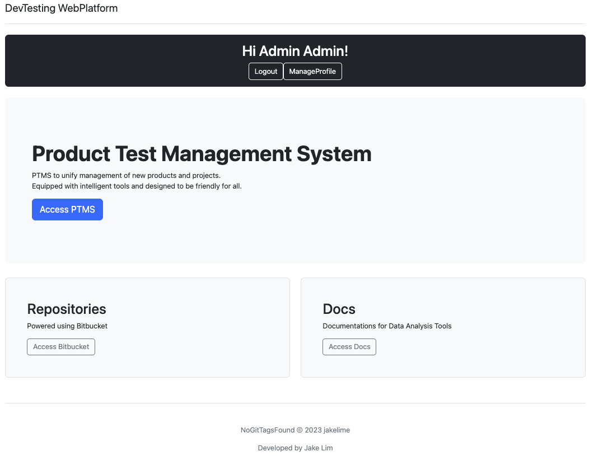
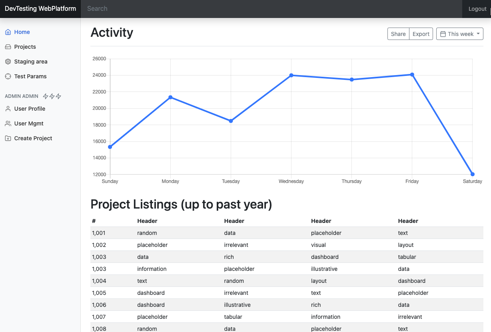

# Web platform

## Quickstart

1. Create `.env` file in the project root directory. This secret key is required for production builds.

   ```text
   DJANGO_SECRET_KEY="django-insecure-gkf$-u6kujne%(wx+md(+=82%93wvx$asc)dimx#o5fs#ic+*p"
   ```

1. This project requires another database repo (confidential). You can create a the sqlite3 database in a
   the parent of the root directory, i.e. `root_dir = "~/webplatform/"` , `database_dir = "~/databases/ptms.sqlite3"`

   This can be configured in the `settings.py` file

1. makemigrations and create db

   ```bash
   cd main
   python manage.py makemigrations accounts
   python manage.py makemigrations ptms
   python manage.py migrate
   ```

1. create superuser: `python manage.py createsuperuser`

1. Runserver using this command: `python main/manage.py runserver`

1. acccess the web application using a webbrowser:

   

   

## Dependencies

```bash
pip install django
pip install python-dotenv
pip install gitpython
pip install crispy-bootstrap5
pip install django-tables2
```
